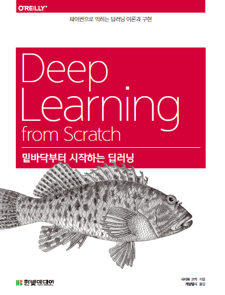

# DL From Scratch

## 1. 교재 

### 밑바닥부터 시작하는 딥러닝

## 2. 목차

아래의 목차를 클릭하면 nbviewer.jupyter.org 에서 Notebook이 열림

- 1장 - *생략*
- [2장 - 퍼셉트론](http://nbviewer.jupyter.org/github/ExcelsiorCJH/DLFromScratch/blob/master/Chap02-Perceptron/Chap02-Perceptron.ipynb)
- [3장 - 신경망](http://nbviewer.jupyter.org/github/ExcelsiorCJH/DLFromScratch/blob/master/Chap03-NeuralNetwork/Chap03-NeuralNetwork.ipynb)
- [4장 - 신경망 학습](https://github.com/ExcelsiorCJH/DLFromScratch/blob/master/Chap04-Neural_Network_Traing/Chap04-Neural_Network_Training.ipynb)
- [5장 - 오차역전파법](https://github.com/ExcelsiorCJH/DLFromScratch/blob/master/Chap05-BackPropagation/Chap05-Backpropagation.ipynb)

## 3. 참고자료

- GitHub: https://github.com/WegraLee/deep-learning-from-scratch